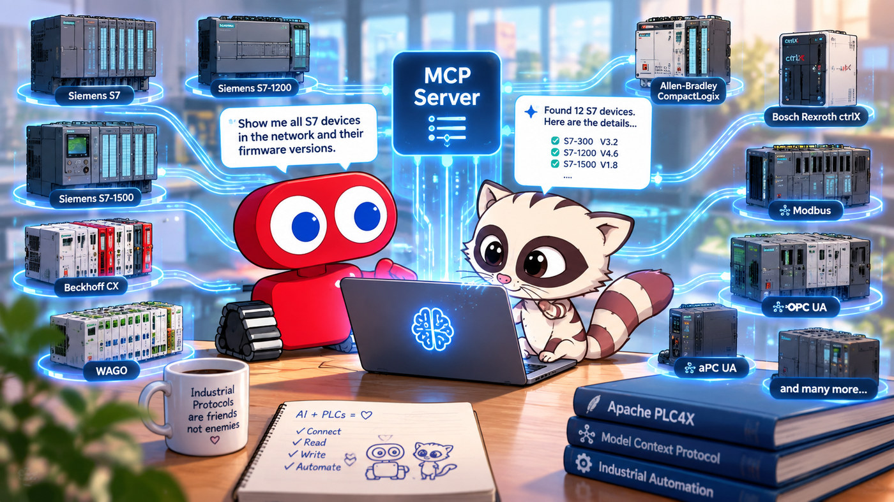

# ToddySoft Connect MCP Server for Apache PLC4X

<p align="center">
  
</p>

An [MCP (Model Context Protocol)](https://modelcontextprotocol.io/) server that exposes
industrial PLC drivers as tools an AI assistant can call — letting a model **discover**,
**browse**, **read**, and **write** tags on real automation hardware (S7, Modbus, OPC UA,
EtherNet/IP, KNX, ADS, Firmata, …) through one uniform interface.

It is a [Spring Boot](https://spring.io/projects/spring-boot) application built on
[Spring AI](https://spring.io/projects/spring-ai)'s MCP server support, speaking the MCP
**stdio** transport so it plugs directly into MCP-capable clients (Claude Desktop, IDE
assistants, and other MCP hosts).

> **This is the open-source edition. It runs entirely on [Apache PLC4X™](https://plc4x.apache.org/)
> drivers and is licensed under the GNU GPL v3.** For the commercially-supported ToddySoft
> Connect driver suite, see [Using the commercial drivers](#using-the-commercial-drivers)
> below.

## What it does

The server registers a small set of MCP tools:

| Tool             | Purpose                                                                    |
|------------------|----------------------------------------------------------------------------|
| `listDrivers`    | List the PLC protocols/drivers available on the classpath                  |
| `describeDriver` | Report one driver's connection parameters, as PLC4X declares them          |
| `discover`       | Discover reachable devices for a driver (where the protocol supports it)   |
| `browse`         | Browse the address/tag space of a connected device                         |
| `read`           | Read one or more tags                                                      |
| `write`          | Write one or more tags                                                     |

Connections are pooled through PLC4X's connection cache, and every tool call is recorded
through PLC4X's audit-log facility.

## Requirements

- **Java 17+**
- **Maven 3.9+**
- Network access to the PLC(s) you want to talk to

## Build

```bash
mvn clean package
```

This produces an executable Spring Boot JAR at
`target/toddysoft-connect-mcp-server-<version>.jar`.

> **Apache PLC4X version:** this project tracks `plc4x.version = 1.0.0` (set in `pom.xml`),
> which is released on Maven Central — no extra repositories are needed.

## Run

The server communicates over **stdio**, so it is normally launched *by* an MCP client
rather than run standalone. Configure your MCP host to start it, e.g.:

```json
{
  "mcpServers": {
    "toddysoft-connect": {
      "command": "java",
      "args": ["-jar", "/absolute/path/to/target/toddysoft-connect-mcp-server-1.0.0-SNAPSHOT.jar"]
    }
  }
}
```

Runtime behaviour (timeouts, connection-cache tuning, server name/version) is configured in
[`src/main/resources/application.yml`](src/main/resources/application.yml).

## Guard-rails

This server hands a model the ability to sweep a network and read and write live PLC tags, so the
defaults are the **safe posture** — an operator opts in to risk rather than out of it:

| Guard-rail                                | Default        | Effect                                           |
|-------------------------------------------|----------------|--------------------------------------------------|
| `security.writes.enabled`                 | `false`        | `write_tags` is **not advertised** to the client |
| `security.writes.allow`                   | `{}`           | Per-device allowlist of writable tag addresses   |
| `security.discovery.enabled`              | `false`        | `discover_devices` is **not advertised**         |
| `security.discovery.protocols`            | `[]`           | Allowlist of protocols permitted to scan         |
| `security.rate-limit.enabled`             | `true`         | Pacing is on out of the box                      |
| `security.rate-limit.per-device`          | 5/s, burst 10  | Protects one controller                          |
| `security.rate-limit.global`              | 20/s, burst 40 | Protects the network                             |
| `security.rate-limit.max-tracked-devices` | `1000`         | Bounds the per-device bucket table               |

A disabled capability is not registered at all rather than advertised and refused: the model never
sees a tool it cannot use, which is both safer and cheaper than a wasted round trip. A startup log
line says which tools are absent and why.

What each tool passes through:

| Tool               | Gate                               | Per-device limit  | Global limit |
|--------------------|------------------------------------|-------------------|--------------|
| `list_drivers`     | —                                  | —                 | —            |
| `describe_driver`  | —                                  | —                 | —            |
| `discover_devices` | protocol allowlist                 | — (no device yet) | ✓           |
| `browse_tags`      | —                                  | ✓                | ✓           |
| `read_tags`        | —                                  | ✓                | ✓           |
| `write_tags`       | writes enabled, then tag allowlist | ✓                | ✓           |

**Discovery is a network scan.** PLC4X discovery is broadcast and multicast traffic, restricted or
forbidden on many plant networks, so the control is an allowlist of protocols permitted to scan —
refusing the scan is the only thing that keeps packets off the wire, and a refusal happens before
the driver is even looked up. Filtering results afterwards would not help; by then the sweep has
gone out. The allowlist is also the fan-out set: an unrestricted `discover_devices` call scans
exactly the allowlisted protocols, never every driver on the classpath.

**Writes are allowlisted per device and per tag.** Enabling writes is the first gate; `allow`
narrows it to specific addresses on specific devices:

```yaml
toddysoft:
  mcp:
    security:
      writes:
        enabled: true
        allow:
          "10.0.0.5":     [ "%DB10.*", "%M0.0:BOOL" ]   # recipe DB and one flag
          "10.0.0.9:502": [ "40001:INT" ]
          "*":            [ "%DB99.*" ]                 # scratch DB on any device
```

Patterns match the raw tag address, since the grammar differs per driver (`%DB10.DBW0:INT`,
`40001[0..3]:INT`, `MAIN.g_var`) and this layer deliberately parses none of them. `*` is the only
wildcard; everything else — `.`, `[`, `:` — is literal, so an address full of regex metacharacters
matches as written. Rules for a device and rules under `"*"` both apply. A device absent from a
non-empty `allow` is refused entirely: that is what makes it an allowlist.

Two rules exist so that the config cannot become more permissive by deletion:

- **An empty `allow` with writes enabled fails at startup.** Delete the last three allowed tags and
  the server says so, rather than either opening every address or silently writing nothing.
- **`"**"` is the only way to permit everything**, and a bare `"*"` pattern is refused with a
  message pointing at it — "everything" should never be one keystroke away from a narrow rule.

**A disallowed tag refuses the whole call.** A multi-tag write is usually one intent — a setpoint
and the flag that acts on it — so applying the permitted half would leave the device in a state
nobody asked for. The refusal names every offending address, not just the first, so one round trip
is enough to correct it, and it is decided before any rate budget is spent.

**Rate limiting uses two buckets, because one is not enough.** A per-device bucket protects a
single PLC, whose control task degrades if its request budget is exceeded. A global bucket protects
the network, since hundreds of devices each politely within their own limit still add up to more
traffic than the line carries. An over-limit call is **refused, never queued** — queuing converts a
burst into held threads and unbounded memory, and leaves the caller unable to tell slow from
throttled. A refusal names how long to wait:

```json
{ "error": "Rate limit exceeded for 10.0.0.5. Retry in 180ms.",
  "reason": "RATE_LIMITED", "retryAfterMillis": 180 }
```

Per-device buckets are capped (`max-tracked-devices`) so tracking cannot itself grow without limit;
buckets that have refilled to full and gone idle are evicted first, and a bucket still constraining
someone is never discarded, since dropping it would silently hand that device a fresh burst.

`list_drivers` and `describe_driver` read driver metadata in-process, send nothing, and are exempt.

### Credentials never reach the log

In Apache PLC4X credentials are ordinary connection parameters — OPC UA's `password`,
`knxproj-password`, the keystore passwords — so the string saying *where* a device is also says how
to authenticate to it. Every connection string is masked before it is logged:

```
read_tags invoked for opcua://10.0.0.5?username=admin&password=*** with 2 tags
```

Which parameters are secret is not this server's guess: each driver declares it through PLC4X's
`Option.isSecret()`, and that declaration is what gets applied. The key stays visible while the
value is masked, because knowing *which* credential was supplied is what diagnosing a failed
connect needs — and `username` is deliberately left intact for the same reason, since masking it
would cost the ability to tell which account failed, for no gain. URL userinfo
(`user:password@host`) is masked unconditionally.

**When the protocol code does not resolve to a driver, every parameter value is masked.** A driver
that cannot be interrogated is exactly the case where we do not know what its secrets are called,
and a name heuristic that misses leaks the thing it exists to protect. Refusals name only the
device (`10.0.0.5`), never the connection string.

### What a refusal looks like

A guard-rail answers in the result rather than as a transport error, so the model gets something it
can act on. Every refusal carries a `reason`; only a rate limit carries `retryAfterMillis`, because
only a rate limit is worth retrying unchanged.

| `reason`               | Meaning                                    | What helps                                     |
|------------------------|--------------------------------------------|------------------------------------------------|
| `WRITES_DISABLED`      | Writing is off on this server              | Enable it in config; retrying will not help    |
| `TAG_NOT_ALLOWED`      | Writing is on, but not at these addresses  | Write an allowlisted address, or widen `allow` |
| `DISCOVERY_DISABLED`   | Discovery is off on this server            | Enable it and allowlist protocols              |
| `PROTOCOL_NOT_ALLOWED` | Discovery is on, but not for this protocol | Use an allowlisted protocol                    |
| `RATE_LIMITED`         | Permitted, but too fast                    | Wait `retryAfterMillis` and retry              |

```json
{ "error": "Write refused: %DB11.DBW0:INT not writable on 10.0.0.5. Nothing was written. See toddysoft.mcp.security.writes.allow.",
  "reason": "TAG_NOT_ALLOWED" }
```

Every refusal is also written to the audit log — that record is what answers "what did the AI try to
do", and a refusal is precisely the event worth finding afterwards.

### Misconfiguration fails at startup

Rather than being silently enforced as something other than what was written down:

- writes enabled with an empty `allow`, or a bare `"*"` pattern in one;
- discovery enabled with no protocols allowlisted;
- a non-positive rate, or a burst below its own per-second rate;
- a non-positive `max-tracked-devices`.

Each failure names the setting and how to correct it.

## Choosing which drivers are exposed

The set of protocols the server offers is simply the set of PLC4X driver JARs on the
classpath. Each `plc4j-driver-*` dependency in [`pom.xml`](pom.xml) adds one protocol
(they register `org.apache.plc4x.java.api.PlcDriver` via the Java `ServiceLoader`). Add or
remove `plc4j-driver-*` dependencies to change the exposed protocol set — the full PLC4X
driver catalogue is listed in the [PLC4X documentation](https://plc4x.apache.org/users/protocols/index.html).

## About ToddySoft Connect

**ToddySoft Connect** is a commercial suite of industrial-protocol drivers built on the
Apache PLC4X foundation — twenty-one drivers behind the same `PlcConnection` interface, each licensed
per driver code. Alongside the open-source protocols it adds drivers, hardening, bug-fixes, and
long-term support that go beyond the Apache project — additional protocols and vendor variants,
security-focused fixes, and a pooling connection cache with recovery. This MCP server is the same
server ToddySoft ships on top of that suite, published here in an open-source form that runs on the
Apache PLC4X drivers instead.

**New in 1.3.0: a full OPC UA client driver.** Until 1.3.0 the commercial suite had no OPC UA
`PlcDriver` at all and this open-source edition was the only one of the two that could open an OPC UA
connection. That gap is closed: `opcua` is now a first-class driver — read, write, browse, native
subscriptions (change-of-state, cyclic and events), server-defined structures, method calls and
historical reads over `opc.tcp` — with the OPC 10000-6 §6.7 security stack **on by default** rather
than as an opt-in. Details in the [driver table](#differences-between-apache-plc4x-and-toddysoft-connect)
below.

Three further things are worth separating out, because they are not "more protocols" and are the part
an AI-facing tool feels most directly:

- **Devices can be diagnosed, and some problems mitigated.** Every driver reports *how far* a
  connection attempt got rather than whether it worked, and a driver that can prepare an
  unreachable device offers that as an explicit, catalogued operation — see
  [below](#how-a-tool-learns-about-a-device-plc4x-here-and-what-tsc-adds).
- **Discovery reports posture, not just addresses.** S7 discovery carries the controller's
  firmware version, and — opt-in, with `observe-posture=true` — the access level it grants an
  unauthenticated session and whether classic PUT/GET is enabled. Both are observed without writing
  anything or attempting any credential, and
  reported as **absent** rather than as a safe-looking default when a probe could not determine it.
  These are the concrete properties behind the "enable password protection" and "disable PUT/GET"
  advice in CSA AA26-231A, so a fleet sweep answers an auditor's question directly.
- **Browse results are held to a contract.** A browse item's `readable` / `writable` /
  `subscribable` flags and its datatype are audited across every browsing driver, so a node that
  cannot actually be read no longer claims it can. That matters here specifically: this server's
  `browse` tool passes those flags straight through to the model, and a tree that lies about them
  sends it to read tags that will always fail.

### Differences between Apache PLC4X and ToddySoft Connect

This open-source edition runs on the Apache PLC4X drivers. The commercial ToddySoft Connect
suite is built on the same PLC4X foundation, but adds protocols PLC4X does not cover and
extends several of the drivers PLC4X shares. The tables below summarize how the two compare,
driver by driver — only fully-implemented drivers are listed.

> **Versions compared:** **ToddySoft Connect 1.3.0** (in preparation; 1.2.0 released 2026-09-10)
> against **Apache PLC4X 1.0.0** (the version this project builds on, set as `plc4x.version` in
> `pom.xml`). Rows marked *new in 1.3.0* or *new in 1.2.0* changed in that release; everything else
> predates it.

**Protocols ToddySoft Connect drives that Apache PLC4X does not:**

| Protocol / driver                   | What it is                                                   | Notes                                                                                                                                                                                                                                                      |
|-------------------------------------|--------------------------------------------------------------|------------------------------------------------------------------------------------------------------------------------------------------------------------------------------------------------------------------------------------------------------------|
| **SIMATIC Web API** (`s7-webapi`)   | Siemens S7-1200/1500 management plane over JSON-RPC/HTTPS    | Diagnostic buffer, alarms, operating-mode read/change and the controller's own account model — surfaces the process-data S7 driver cannot reach                                                                                                            |
| **IEC 61850** (`iec-61850`)         | Substation automation client / subscriber                    | MMS read/write/browse/report, control state machine (Direct / SBO / Enhanced-SBO), plus GOOSE and Sampled-Values subscription                                                                                                                              |
| **MTConnect** (`mtconnect`)         | Manufacturing-equipment telemetry                            | HTTP (poll + chunked streaming), MQTT and WebSocket transports; XML and JSON payloads; devices + assets                                                                                                                                                    |
| **PROFINET** (`profinet`)           | PROFINET IO controller — cyclic IO to PROFINET devices       | Connect/keep-alive handling validated against brownfield controllers, with reconnection handled at the connection-cache level. Apache PLC4X ships PROFINET drivers, but they are not currently operational, so in practice this protocol is ToddySoft-only |
| **EtherCAT** (`ethercat`)           | EtherCAT fieldbus master                                     | Slave scan, EEPROM/CoE mailbox, PDO mapping and cyclic process image (distributed-clocks bring-up for DC-mandatory hardware is in progress)                                                                                                                |
| **SunSpec** (`sunspec`)             | Solar inverters / DER over Modbus                            | Model-map discovery on top of the Modbus stack                                                                                                                                                                                                             |
| **Art-Net** (`artnet`)              | Art-Net 4 / DMX512 lighting control                          | UDP output to Art-Net nodes; node discovery; optional RDM tunnelling                                                                                                                                                                                       |
| **Fatek** (`fatek`)                 | Fatek FBs controllers, ASCII over TCP and serial             | No Apache PLC4X counterpart exists                                                                                                                                                                                                                         |
| **C-Bus** (`cbus`)                  | Clipsal C-Bus building automation                            | Apache PLC4X has a c-bus driver in its tree, but 1.0.0 does not publish it to Maven Central, so in practice this protocol is ToddySoft-only                                                                                                                |
| **ctrlX** (`ctrlx`)                 | Bosch Rexroth ctrlX CORE — Data Layer over REST              | Apache PLC4X ships a ctrlX driver, but it is not currently operational, so in practice this protocol is ToddySoft-only                                                                                                                                     |
| **Open Protocol** (`open-protocol`) | Atlas Copco / Open Protocol tightening tools and controllers | Apache PLC4X ships an Open Protocol driver, but it is not currently operational, so in practice this protocol is ToddySoft-only                                                                                                                            |

(ToddySoft's `melsoft` driver covers the Mitsubishi MELSEC family, which PLC4X reaches through
its own `slmp` driver — so that hardware is served by both, under different names.)

**Where both suites have a driver — what the commercial edition adds:**

| Protocol                                        | Apache PLC4X                                         | ToddySoft Connect adds                                                                                                                                                                                                                                                                                                                                                                                                                                                                                                                                                                                                                                                                                                                                                                                                                                                                                                                                                                                                                                                                                                                                                                                                                                              |
|-------------------------------------------------|------------------------------------------------------|---------------------------------------------------------------------------------------------------------------------------------------------------------------------------------------------------------------------------------------------------------------------------------------------------------------------------------------------------------------------------------------------------------------------------------------------------------------------------------------------------------------------------------------------------------------------------------------------------------------------------------------------------------------------------------------------------------------------------------------------------------------------------------------------------------------------------------------------------------------------------------------------------------------------------------------------------------------------------------------------------------------------------------------------------------------------------------------------------------------------------------------------------------------------------------------------------------------------------------------------------------------------|
| **OPC UA** (*new in 1.3.0*)                     | Read/write/browse/subscribe over `opc.tcp`           | A client driver written against OPC 10000-6, where PLC4X's is the long-standing open-source one. **Security is on by default**: a signing-and-encrypting policy, a client certificate generated into a persistent key store with a SAN URI matching `application-uri`, and a server certificate **refused** unless trusted — an unprotected channel, or a password over one, needs `allow-insecure=true` spelled out. Adds **server-defined structures** as `PlcStruct` values, read, written *and subscribed*, with an unresolvable layout reported as `UNSUPPORTED` rather than as a silent null; **event subscriptions** with named fields; **method calls** and **historical reads**; and a browse bounded in items, continuations and depth. Validated on an S7-1500, an S7-1200 and an S7-1200 G2. **PubSub** (UADP over UDP multicast) rides along as a subscribe mode of the same connection, but is **incomplete and unproven on a controller** — secured NetworkMessages, the JSON mapping and the MQTT/AMQP bindings are not implemented. The tag grammar is **deliberately incompatible** with the PLC4X driver's — `ns=2;s=Var[0..4]:INT`, a `:TYPE` suffix with the array selection before it — so migrating is a rewrite of addresses, not a drop-in |
| **S7**                                          | Classic S7comm (`0x32`) to S7-300/400/1200/1500      | A working **S7CommPlus** stack: **V3/TLS** to S7-1500 & S7-1200 G2, **password authentication**, native **cyclic subscriptions**, **alarming**, online browse, and a `min-protocol`/`max-protocol` security window (plaintext-downgrade protection); plus an optimizer that greatly improves write performance                                                                                                                                                                                                                                                                                                                                                                                                                                                                                                                                                                                                                                                                                                                                                                                                                                                                                                                                                      |
| **ADS** (Beckhoff)                              | Symbol read/write/browse/subscribe against TwinCAT 3 | **TwinCAT 2** connectivity (PLC4X targets TwinCAT 3 only); reads **large symbol and data-type tables** that exceed a single ADS read, via automatic chunked uploads — needed on big PLC programs; **AoE** — EtherCAT slave telemetry (identity, AL state, CRC/frame counters, TwinSAFE FSoE) over the same ADS link; **TLS** transport; symbol-table reload; **route registration as an explicit setup operation** rather than part of every connect (*new in 1.2.0* — see below)                                                                                                                                                                                                                                                                                                                                                                                                                                                                                                                                                                                                                                                                                                                                                                                   |
| **UMAS** (Schneider Modicon)                    | Basic driver                                         | A much more complete UMAS implementation — reads and writes, subscriptions, and array / structure addressing                                                                                                                                                                                                                                                                                                                                                                                                                                                                                                                                                                                                                                                                                                                                                                                                                                                                                                                                                                                                                                                                                                                                                        |
| **EtherNet/IP** (Allen-Bradley)                 | Read/write by symbolic tag                           | **Online tag browsing** of Allen-Bradley Logix controllers — discovers controller-scoped and program-scoped tags via the CIP Symbol object (class `0x6B`), cached for O(1) symbolic-name resolution                                                                                                                                                                                                                                                                                                                                                                                                                                                                                                                                                                                                                                                                                                                                                                                                                                                                                                                                                                                                                                                                 |
| **Modbus**                                      | Read/write with the standard function codes          | Optimizers on both sides — an optimizer that greatly improves write performance, and, *new in 1.2.0*, a read optimizer that sends a multi-tag read as the chunks it produced                                                                                                                                                                                                                                                                                                                                                                                                                                                                                                                                                                                                                                                                                                                                                                                                                                                                                                                                                                                                                                                                                        |
| **KNXnet/IP**, **IEC 60870-5-104**, **Firmata** | Full drivers                                         | Essentially on par — maintained ports on the shared ToddySoft licensing, connection-cache and audit-log infrastructure (KNXnet/IP, like PLC4X, refreshes its manufacturer-ID table at build time)                                                                                                                                                                                                                                                                                                                                                                                                                                                                                                                                                                                                                                                                                                                                                                                                                                                                                                                                                                                                                                                                   |

**Protocols Apache PLC4X drives that ToddySoft Connect does not:** the open-source suite is
broader in a few areas, and for these this edition is the one to use.

| Protocol / driver                         | What it is                                                         |
|-------------------------------------------|--------------------------------------------------------------------|
| **Allen-Bradley DF1 / AB-ETH** (`ab-eth`) | Legacy Allen-Bradley PLCs over Ethernet                            |
| **Omron FINS**                            | Omron controllers over the FINS protocol                           |
| **CANopen / raw CAN** (`canopen`, `can`)  | CANopen and raw CAN bus access                                     |

OPC UA was on that list until 1.3.0 — the commercial suite shipped the wire layer and no driver
behind it — and no longer is. ToddySoft Connect still ships **wire layers only** for BACnet/IP,
CC-Link, FOCAS and IO-Link: no `PlcDriver` stands behind any of them, so no connection can be opened
with them. For those protocols, and for the ones in the table above, this edition is the one that
talks to a device.

Every ToddySoft driver additionally rides the suite's shared infrastructure: the pooling
connection cache with recovery, the audit log, and per-driver licensing. Two capability APIs sit on top
of that infrastructure, and they are the sharpest difference for a *tool* rather than for a
protocol — see below, along with what this edition uses instead.

### How a tool learns about a device: PLC4X here, and what TSC adds

**Apache PLC4X has not undergone the authentication and device-setup rework described below (it
landed in ToddySoft Connect 1.2.0), so expect the two suites to differ here — and this edition is
written for the PLC4X API, not against it.** What follows is first what PLC4X gives a tool (which is what this server actually uses), then
what the commercial suite does differently, because the difference is easy to misread as a gap.

#### What this edition uses: `PlcDriverMetadata`

PLC4X drivers are introspectable. Every driver publishes, without contacting a device:

- its **supported transports** and default transport, and whether it supports discovery
  (`PlcDriverMetadata`);
- its **protocol configuration options**, and the options of each transport
  (`getProtocolConfigurationOptionMetadata()` / `getTransportConfigurationOptionMetadata(code)`),
  each `Option` carrying a key, type, description, required flag, default value, `since`, and
  `isSecret()`.

That is PLC4X's answer to "how do I configure a connection to this thing", and it is a genuinely
rich one — OPC UA alone declares 29 protocol options, the TLS transport 19. This server exposes it
directly: `list_drivers` reports the supported transports, and **`describe_driver`** returns a
driver's options so a model can build a valid connection string from what the driver itself
declares, rather than guessing at parameter names.

**Credentials in PLC4X are ordinary connection parameters.** OPC UA's `username` and `password`,
the keystore passwords, `knxproj-password` — they live in the connection string, and PLC4X marks
them with `Option.isSecret()` so a tool knows to mask them. `PlcAuthentication` exists in the API
(`PlcUsernamePasswordAuthentication`, `PlcCertificateAuthentication`, `PlcNullAuthentication`) and
`getConnection(url, authentication)` accepts it, but the drivers' own configuration is where the
credentials are actually read from. Treat `secret` options as sensitive: pass them in the connection
string you hand the tool, and do not echo them back into a transcript or log.

#### What the commercial suite does differently

The rest of this section describes **ToddySoft Connect capabilities only**, which have no Apache
PLC4X equivalent. Neither adds or changes an Apache PLC4X type: a TSC driver still loads as a plain
`PlcDriver` in a stock PLC4X runtime, which simply never sees them. **This open-source edition
cannot expose any of it** — it is here so the difference is legible, not as a description of what
this server does.

These are one story in two halves — **diagnose, then mitigate**: the check says what is wrong, and
for the subset of problems that are the device's own configuration, a setup function fixes it.

**Diagnosing: how far did a connection attempt actually get?**

Every driver answers `checkConnection(...)` with the **stage** an attempt reached rather than a
boolean — `TRANSPORT_NOT_ESTABLISHED`, `PROTOCOL_REFUSED`, or `ESTABLISHED`. That distinction is
what makes an honest readiness probe possible: a device that never answered supports no conclusion
about how it is configured, while a device that answered and refused does. ADS refines the result
with decoded findings; every other driver reports at least the stage.

**Configuring: preparing a device that cannot be talked to yet**

Some devices reject every client until a one-time, privileged act has been performed on them — an
ADS/AMS target needs a route registered, a factory-default PROFINET device has no usable IP or
station name. `PlcDeviceSetup` gives that its own call instead of folding it into connect:

- A driver publishes a catalogue of `SetupFunction`s for a given connection string
  (`getSupportedSetupFunctions`), each carrying its own configuration class, operator-facing
  description, security caveat, and whether it is reversible or persistent — so a tool can render
  the form without knowing anything about the protocol.
- `needsSetup(...)` is *derived* from the staged connection check above, so a probe and a check
  cannot disagree, and a transport failure can never be promoted into "this device needs setup".
- Shipping implementors: **ADS** route registration (three functions, one per transport — the
  plain-AMS one declaring that its credentials cross the network in clear) and **PROFINET**
  set-ip / set-name (unauthenticated layer-2 writes that report themselves irreversible).

The point is where the credentials end up. Registering an ADS route during connect forces
administrator credentials into the configuration every reading process carries for the life of the
connection; as a separate operation they appear once, in something that ends. (Consequently
`route-name` / `route-username` / `route-password` are no longer ADS connection parameters, and a
connect no longer registers a route.)

**Diagnosing further: what the device reports about its own posture**

S7 discovery does not stop at "there is a controller at this address". A discovered item also
carries the **firmware version** (and, against an operator-supplied baseline, whether it matches).
Ask for posture with `observe-posture=true` — off by default, so a plain sweep sends no posture
probe at all — and the item additionally reports the **access level the controller grants an
unauthenticated session** and, on an S7-1200/1500, whether **classic PUT/GET access is enabled** —
the properties behind two of the mitigations in CSA AA26-231A (NSA/CISA/FBI, *Defending Against an Active Threat to
Siemens S7 Series PLCs*). Three constraints make the result usable rather than merely interesting:
the probe **writes nothing and attempts no credential**, it observes only what the device grants
unauthenticated; a controller under complete protection that answers by *hiding* is reported as its
own state rather than as an error or as open access; and an attribute that could not be determined
is **absent**, never defaulted to a safe-looking value. The protection-level decode is
documentation-derived pending a bench pass across every TIA setting, so treat it as an indicator to
confirm rather than an audit result.

**Browsing: items that tell the truth about themselves**

A browse tree is a promise a consumer acts on, and this server is exactly such a consumer — its
`browse` tool passes `readable` straight through to the model, which then decides what to read.
Across the suite a browse item's accessibility flags and datatype are held to one contract, enforced
by conformance tests and golden masters over every browsing driver rather than described in prose:
a structural node that cannot be read directly no longer claims a fabricated `BYTE` type at offset 0
with `readable=true`, and an item's name is not silently something other than its address. The
failure it removes is a quiet one — a model that dutifully reads what the tree offered and gets
errors back for tags that were never readable.

**Authenticating: credentials as a declared capability, out of the connection string**

This is the change Apache PLC4X has **not** made, and the one most likely to trip up code moving
between the two — in ToddySoft Connect it is a shipped breaking change as of 1.2.0. PLC4X has always had a place to put credentials — `getConnection(url,
PlcAuthentication)` — and almost nothing used it; credentials lived in the protocol configuration
object instead (as they still do in PLC4X, and therefore in this edition), which means they were
typed into the connection string, and the connection string is what every process holds for the life
of the connection, writes to its config files, and hands to its logs. The TSC cleanup makes that
argument load-bearing across every driver and moves the credentials out:

- Drivers declare `getSupportedAuthenticationMethods(connectionString)` — a catalogue of
  `AuthenticationMethod` records (code, description, layer, whether it is required, the
  configuration class, and an optional security caveat) shaped deliberately like `SetupFunction`.
  It replaces the old `getSupportedAuthenticationTypes(url)`, which returned bare class objects and
  therefore could not drive a credential form or warn an operator about anything.
- The catalogue is **per connection string, not per driver**: the same method carries a
  cleartext-credentials caveat over an unencrypted transport and no caveat over an encrypted one.
  Transport-layer methods are merged in automatically, so a driver on `tls-psk` publishes
  `pre-shared-key` without writing a line.
- Answering the catalogue does **no device I/O and no licence check**, so a tool can render "here is
  how you can authenticate to this" offline, in a settings dialog, or in documentation.
- Credential parameters are gone from protocol and transport configuration; connection pooling is
  credential-aware, obtaining the credential per lease rather than retaining it; and connection
  profiles referenced by alias keep credentials out of connection strings entirely. This also closes
  a real leak: the audit log's configuration event was built by an extraction that read raw property
  values and knew nothing about `@Secret`, so with the audit log enabled some passwords were written
  to it in clear.

Which protocols and which of these extensions matter is workload-specific — if PLC4X already covers
your devices and the GPL fits your use, this edition is all you need; if you need one of the
protocols, capabilities or extensions above, or non-GPL terms, see
[below](#using-the-commercial-drivers).

## About Apache PLC4X

[Apache PLC4X™](https://plc4x.apache.org/) is a top-level Apache® Software Foundation project
providing a unified API and a large catalogue of open-source drivers for industrial
protocols. This edition of the MCP server depends **only** on Apache PLC4X (licensed under
the Apache License 2.0) for all PLC communication — the driver implementations, the
connection cache, the audit log, and the value model are all PLC4X. If PLC4X covers your
protocols and your use case fits the GPL, you need nothing else here.

## Using the commercial drivers

If you want to:

- use the **commercially-supported ToddySoft Connect drivers** (extra protocols, vendor
  variants, security fixes, and support), or
- **embed this MCP server, or the drivers, in your own product** under terms other than the
  GPL (e.g. a proprietary/closed-source solution),

then the GPL open-source edition may not fit — reach out for a commercial offer:

**➡ [https://toddysoft.com](https://toddysoft.com)**

## License

Copyright (C) 2026 ToddySoft GmbH.

This program is free software: you can redistribute it and/or modify it under the terms of
the **GNU General Public License v3.0** as published by the Free Software Foundation, either
version 3 of the License, or (at your option) any later version. See the [LICENSE](LICENSE)
file for the full text.

## Trademarks

Apache PLC4X, PLC4X, Apache, the Apache feather logo, and the Apache PLC4X project logo are either
registered trademarks or trademarks of [The Apache Software Foundation](https://www.apache.org/) in
the United States and other countries. All other marks mentioned may be trademarks or registered
trademarks of their respective owners.

These marks are used here for identification only, to state accurately which open-source software
this project is built on. **This project is not affiliated with, endorsed by, or sponsored by The
Apache Software Foundation.** ToddySoft and ToddySoft Connect are marks of ToddySoft GmbH.

The banner at the top of this page includes an original drawing that depicts **Toddy**, the mascot of
the Apache PLC4X project, alongside the ToddySoft robot. It is a new illustration rather than a copy
of the project's artwork, and it is used to show the relationship between the two projects, not to
imply endorsement by the ASF.
